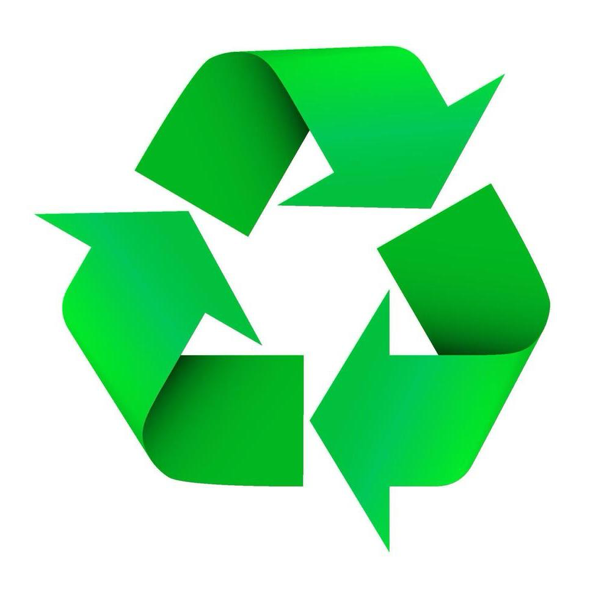

# CANDY TRASH

## INDICE
- [DESCRIZIONE](#DESCRIZIONE)
- [LINK DI RIFERIMENTO](#LINK-DI-RIFERIMENTO)
- [REPERTORIO](#REPERTORIO)

## DESCRIZIONE
Questo sito web, creato con HTML, JavaScript e CSS, è un gioco simile a candy crash.
Il sito inizia con la selezione della dimensione della tabella e del nome,
per poi passare al tutorial che spiega come giocare. Successivamente inizia il vero e
proprio gioco. A seconda del risultato finale, il gioco rimanderà l'utente 
ad una pagina di vittoria o una pagina di sconfitta.

### POSSIBILI COMBINAZIONI:
- Tris: si eliminano i tre elementi uguali
- Quaterna: genera il potere del riciclo, che permette di eliminare a croce gli elementi più vicini ad esso

- Cinquina: genera l'amore della natura, che permette di eliminare tutti gli elementi attorno ad esso

## LINK DI RIFERIMENTO
- https://www.kennyyipcoding.com/
- https://www.microsoft.com/it-it/microsoft-copilot

## REPERTORIO
